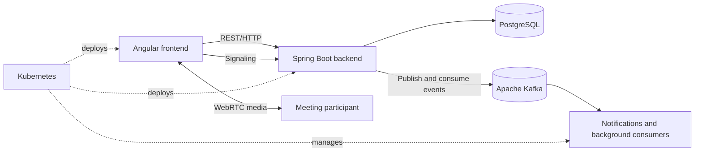

# EnterpriseHub AI

EnterpriseHub is a multi-business management platform. It provides shared business functionality to every organization and enables specialized modules based on the organization's type and operational needs.

It is also a collaborative learning project. The team will use it to practise modular application design, event-driven systems with Apache Kafka, real-time communication with WebRTC, and container orchestration with Kubernetes.

The platform is designed to support several company types:

- `STARTUP`
- `SMALL_BUSINESS`
- `ENTERPRISE`
- `MALL`
- `GROCERY_STORE`

## Product vision

EnterpriseHub gives each organization its own workspace, users, permissions, data, and enabled modules. A company's type determines its recommended modules, while administrators can enable additional capabilities when required.

For example, a grocery store can use EnterpriseHub as a point-of-sale and inventory system, while a large enterprise can use it for departments, employees, projects, documents, workflows, and analytics.

## Shared platform functionality

Functionality available across company types can include:

- Company profiles and workspaces
- Users, memberships, roles, and permissions
- Employees and customers
- Notifications
- Documents
- Reporting
- Subscription and billing
- Audit logs
- Multiple business locations
- Real-time video meetings
- Event-driven notifications and integrations

## Company-specific functionality

### Startup

- Projects and tasks
- Team collaboration
- Expenses
- Documents
- Basic analytics

### Small business

- Customers
- Products and services
- Quotes and invoices
- Expenses and accounting
- Inventory

### Grocery store

- Point of sale (POS)
- Products and categories
- Barcode scanning
- Inventory and stock movements
- Suppliers and purchases
- Sales and receipts
- Cash-register sessions
- Low-stock notifications
- Expiration-date tracking
- Sales reports

### Mall

- Stores and tenants
- Rental contracts
- Rent and payment tracking
- Maintenance requests
- Security operations
- Shared facilities
- Mall analytics

### Enterprise

- Departments and employees
- Projects and tasks
- Approval workflows
- Document management
- Advanced permissions
- Multiple locations
- Analytics dashboards
- Audit and compliance features

## Modular architecture

`CompanyType` describes an organization's category, but business features should be represented as independent modules. This avoids hard-coding company-type checks throughout the application.

Example modules:

```text
POS
PRODUCTS
INVENTORY
SUPPLIERS
PURCHASES
SALES
CUSTOMERS
PROJECTS
TASKS
EMPLOYEES
DOCUMENTS
ANALYTICS
```

A company type provides sensible defaults:

```text
GROCERY_STORE  -> POS, PRODUCTS, INVENTORY, SUPPLIERS, PURCHASES, SALES
STARTUP        -> PROJECTS, TASKS, EMPLOYEES, DOCUMENTS
SMALL_BUSINESS -> CUSTOMERS, PRODUCTS, SALES, INVENTORY
ENTERPRISE     -> EMPLOYEES, PROJECTS, DOCUMENTS, ANALYTICS
MALL           -> EMPLOYEES, DOCUMENTS, ANALYTICS, tenant-management modules
```

Modules can later be enabled or disabled independently. This allows, for example, an enterprise to operate a POS system or two grocery stores to use different feature sets.

## Planned technical architecture



### Apache Kafka

Kafka will be introduced when the project has real asynchronous workflows. Planned examples include:

- `sale.completed` updates inventory and reporting.
- `stock.low` triggers notifications.
- `purchase.received` creates stock movements.
- `company.created` prepares default modules.
- Audit events record important business actions.

Kafka should not replace normal synchronous CRUD calls. The REST API remains appropriate when a user needs an immediate response. Event schemas, retry behavior, idempotency, and dead-letter handling must be designed before Kafka is used in production.

### WebRTC video calls

WebRTC will support real-time meetings for company members. The browser handles peer media, while the backend provides authenticated signaling and meeting authorization. The learning scope includes:

- Camera and microphone permissions
- Peer connections and media tracks
- Signaling over WebSocket
- STUN/TURN connectivity
- Screen sharing
- Meeting access control
- Connection cleanup and error states

For larger group calls, the project may later evaluate an SFU instead of relying on peer-to-peer mesh connections.

### DevOps and Kubernetes

Kubernetes is a later deployment stage, after local Docker-based development is stable. The planned learning scope includes:

- Container images for frontend and backend
- Deployments, Services, and Ingress
- ConfigMaps and Secrets
- Readiness and liveness probes
- Resource requests and limits
- Horizontal scaling
- Database and Kafka connectivity
- CI/CD, observability, and rollback strategies

Local development should remain simple with Docker Compose. Kubernetes manifests and deployment notes belong under `infrastructure/kubernetes`.

## Recommended development roadmap

1. Complete company management.
2. Add users and company membership.
3. Add roles and permissions.
4. Introduce company modules and feature access.
5. Build products and categories.
6. Build inventory and stock movements.
7. Add suppliers and purchases.
8. Add POS, sales, receipts, and cash-register sessions.
9. Add reporting and notifications.
10. Introduce Kafka through one justified business event.
11. Add authenticated WebRTC signaling and one-to-one video calls.
12. Containerize the applications and create CI pipelines.
13. Deploy the stateless services to Kubernetes.
14. Add startup, mall, and enterprise-specific modules.

The first focused product can be **EnterpriseHub Grocery**: a multi-company POS and inventory platform built on the shared EnterpriseHub foundation. Once that workflow is complete, the same platform can be expanded for other organization types.

## Repository structure

```text
EnterpriseHub AI/
|-- backend/          Spring Boot API and Kafka integration
|-- frontend/         Angular application and WebRTC client
|-- docs/             Architecture and learning notes
|-- infrastructure/   Kubernetes and deployment configuration
|-- compose.yaml      Local infrastructure
|-- README.md         Product vision and roadmap
```

Backend setup is documented in [`backend/README.md`](backend/README.md), and frontend setup is documented in [`frontend/README.md`](frontend/README.md). The future-system notes live under [`docs/architecture`](docs/architecture).
