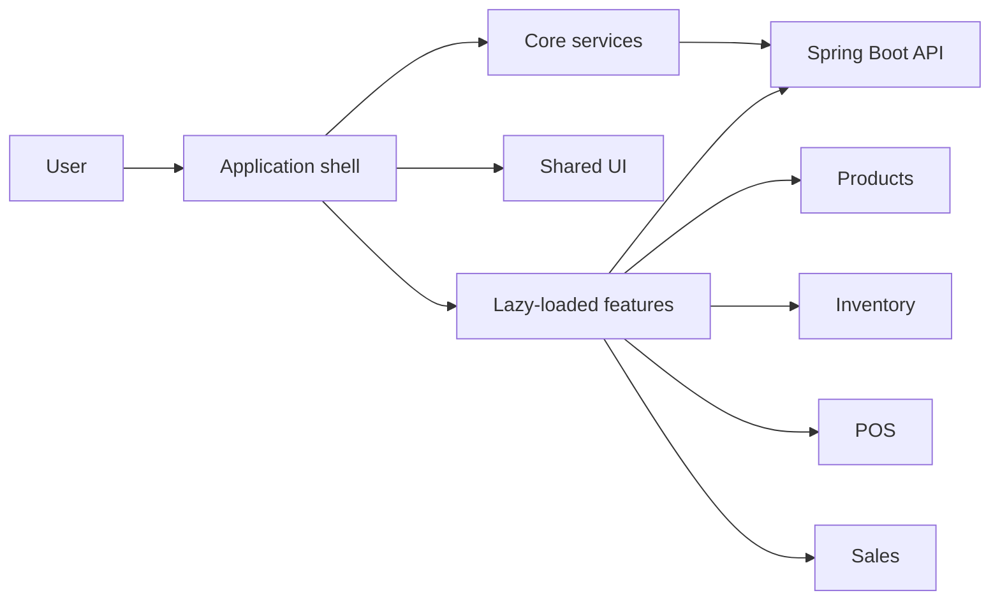

# EnterpriseHub Frontend

> A learning-focused Angular application for building a modular, multi-business management platform.


## Why this project exists

EnterpriseHub is being built to learn how a real business application grows from a simple CRUD feature into a maintainable product. It supports multiple organization types, including startups, small businesses, enterprises, malls, and grocery stores.

The first focused product is **EnterpriseHub Grocery**. Its planned capabilities include products, inventory, suppliers, purchasing, point of sale, sales, customers, employees, and reports.

This repository is not only about completing features. It is a place to practise:

- Modern standalone Angular architecture
- TypeScript and reactive programming
- Feature-based modular design
- Lazy-loaded routing
- API integration with Spring Boot
- Authentication and authorization
- Form validation and error handling
- Unit, component, and end-to-end testing
- Git collaboration and code review
- WebRTC media, signaling, and real-time connection lifecycle
- Event-driven UI updates from backend Kafka workflows
- Containerized deployment and Kubernetes fundamentals

## Architecture

The frontend is a **modular monolith**: one Angular application and one deployment, divided into explicit business features. It avoids micro-frontend deployment complexity while keeping boundaries that can scale.



### Dependency rules

```text
features  -> core + shared
layout    -> core + shared
core      -> shared
shared    -> Angular only
```

- `core` contains singleton application infrastructure and must not depend on features.
- `shared` contains reusable, business-neutral code and must not depend on features.
- A feature owns its pages, components, state, API access, and models.
- Features should not import another feature's internal files.
- Routes should be lazy-loaded whenever practical.

## Folder structure

```text
src/
|-- app/
|   |-- core/
|   |   |-- auth/             Authentication and session management
|   |   |-- http/             Interceptors and API configuration
|   |   |-- company/          Active-company context
|   |   |-- permissions/      Roles, capabilities, and guards
|   |   `-- notifications/    Global notification services
|   |-- shared/
|   |   |-- components/       Business-neutral reusable UI
|   |   |-- directives/       Reusable DOM behavior
|   |   |-- pipes/            Presentation transformations
|   |   `-- models/           Truly shared types
|   |-- layout/
|   |   |-- shell/            Main authenticated layout
|   |   |-- sidebar/          Feature navigation
|   |   `-- header/           Workspace header
|   |-- features/
|   |   |-- dashboard/
|   |   |-- products/
|   |   |-- inventory/
|   |   |-- suppliers/
|   |   |-- purchases/
|   |   |-- pos/
|   |   |-- sales/
|   |   |-- customers/
|   |   |-- employees/
|   |   |-- video-calls/
|   |   |-- reports/
|   |   `-- settings/
|   `-- app.routes.ts
`-- styles/
    |-- _variables.scss
    `-- _reset.scss
```

## Getting started

### Requirements

- Node.js compatible with Angular 22
- npm 12 or compatible
- The EnterpriseHub Spring Boot backend for API work

### Install and run

```bash
npm install
npm start
```

Open <http://localhost:4200>.

### Useful commands

```bash
npm start       # development server
npm run build   # production build
npm test        # unit tests with Vitest
```

## How to build a feature

Develop one vertical slice at a time. A mature feature may look like:

```text
features/products/
|-- pages/
|   |-- product-list/
|   `-- product-form/
|-- components/
|-- data-access/
|   |-- product-api.ts
|   `-- product-store.ts
|-- models/
`-- products.routes.ts
```

Recommended workflow:

1. Define the user story and acceptance criteria.
2. Confirm the backend API contract.
3. Add the feature route and page.
4. Add typed request and response models.
5. Put HTTP access in `data-access`, not directly in a component.
6. Handle loading, empty, success, and error states.
7. Add tests.
8. Update documentation when the architecture changes.

## Learning roadmap

- [x] Generate the Angular application with SCSS
- [x] Establish the application shell and feature boundaries
- [x] Configure lazy dashboard loading
- [ ] Connect Company CRUD to the Spring Boot API
- [ ] Add authentication and session handling
- [ ] Add company membership and permissions
- [ ] Build products and categories
- [ ] Build inventory and stock movements
- [ ] Build suppliers and purchasing
- [ ] Build POS checkout and receipts
- [ ] Add authenticated WebRTC signaling
- [ ] Build one-to-one video calls and screen sharing
- [ ] Display real-time notifications produced by Kafka workflows
- [ ] Add reports and dashboards
- [ ] Add unit and end-to-end tests

## Collaboration rules

- Create a branch for each feature or fix.
- Keep commits small and explain why a change exists.
- Do not commit `node_modules`, build output, secrets, or local IDE state.
- Do not place business logic in presentation components.
- Run `npm run build` and `npm test` before requesting review.
- Explain unfamiliar patterns in the pull request so the whole team learns.

## Related project

The Spring Boot API lives in [`../backend`](../backend). The repository-level product vision and roadmap live in [`../README.md`](../README.md).
